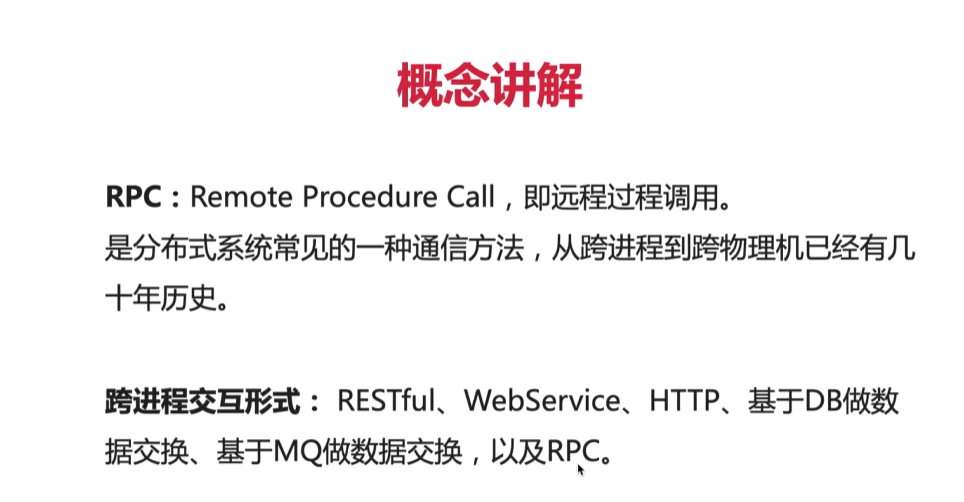
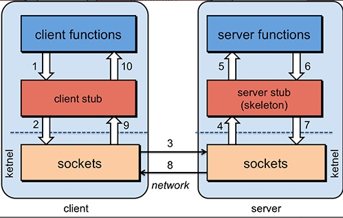
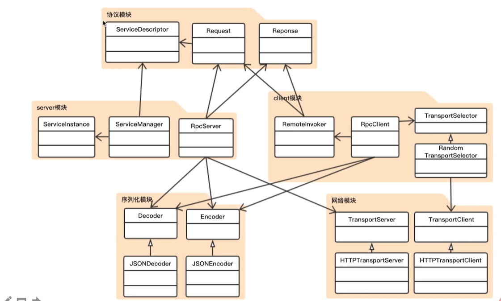
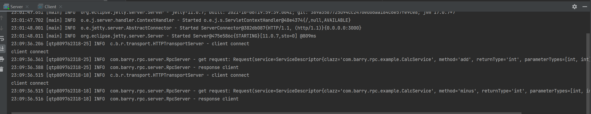
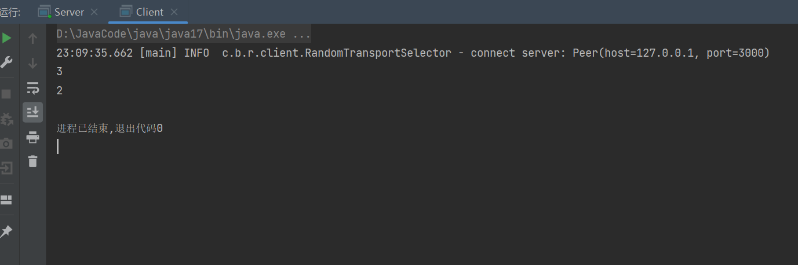

RPC-Simple

从0到1完成一个RPC框架，包括服务调用、序列化、网络传输等等。

## 1. RPC概述
### 1.1 RPC原理



(1).服务消费端（client）以本地调用的方式调用远程服务；

(2).客户端 Stub（client stub） 接收到调用后负责将方法、参数等组装成能够进行网络传输的消息体（序列化）：`RpcRequest`；

(3).客户端 Stub（client stub） 找到远程服务的地址，并将消息发送到服务提供端；

(4).服务端 Stub（桩）收到消息将消息反序列化为 Java 对象: `RpcRequest`；

(5).服务端 Stub（桩）根据RpcRequest中的类、方法、方法参数等信息调用本地的方法；

(6).服务端 Stub（桩）得到方法执行结果并将组装成能够进行网络传输的消息体：`RpcResponse`（序列化）发送至消费方；

(7).客户端 Stub（client stub）接收到消息并将消息反序列化为 Java 对象:`RpcResponse` ，这样也就得到了最终结果。over!

----------------------------------------------
### 1.2 RPC和HTTP的区别
**RPC接口**即相当于调用本地接口一样调用远程服务的接口；

**HTTP接口**是基于http协议的post接口和get接口（等等，2.0版本协议子支持更多）。

**(1)传输协议**

RPC：可以基于TCP协议，也可以基于HTTP协议。

HTTP：基于HTTP协议。

**(2)传输效率**

RPC：使用自定义的TCP协议，可以让请求报文体积更小，或者使用HTTP2.0协议，也可以很好地减少报文体积，提高传输效率。

HTTP：如果时基于HTTP1.1的协议，请求中会包含很多无用的内容；如果是基于HTTP2.0，那么简单地封装一下还是可以作为一个RPC使用的，这时标准RPC框架更多是服务治理。

**(3)性能消耗**

RPC：可以基于thrift实现高效的二进制传输

HTTP：大部分是通过json实现的，字节大小和序列化耗时都比thrift要更消耗性能

**(4)负载均衡**

RPC：基本都自带了负载均衡策略

HTTP：需要配置Nginx，HAProxy实现

**(5)服务治理（下游服务新增，重启，下线时如何不影响上游调用者）**

RPC：能做到自动通知，不影响上游

HTTP：需要事先通知，修改Nginx/HAProxy配置

**RPC主要用于公司内部服务调用，性能消耗低，传输效率高，服务治理方便。HTTP主要用于对外的异构环境，浏览器调用，APP接口调用，第三方接口调用等等。**

**(6)RPC和HTTP都可以用于实现远程过程调用，如何选择**

从**速度**上看，RPC比HTTP更快，虽然底层都是TCP，但是http协议的信息往往比较臃肿，不过可以采用gzip压缩

从**难度**上看，RPC实现较为复杂，http相对简单

从**灵活性**上看，HTTP更胜一筹，因为它不关心实现细节，跨平台，跨语言

**(7)两者有不同的使用场景：**

如果对效率要求更高，并且开发过程使用统一的技术栈，那么RPC还是不错的

如果需要更加灵活，跨语言、跨平台，显然HTTP更合适


## 2. 整体架构


## 3.文件结构
(1) common通用工具模块
    
(2) transport网络传输模块
```java
//处理网络请求的handle
public interface RequestHandler {
void onRequest(InputStream recive, OutputStream toRespon);
}
```

```java
//RPC server服务定义
public interface TransportServer {
    //初始化Server服务
    void init(int port, RequestHandler handler);
    //开启Server服务
    void start();
    //关闭Server服务
    void stop();
}
```

```java
//客户端 也是服务消费者
public interface TransportClient {
    //连接Server服务
    void connect(Peer peer);
    //订阅Server服务  并返回response
    InputStream write(InputStream data);
    //关闭
    void close();
}
```

(3) codec编解码模块
    
(4) serialize序列化模块
        
    序列化和反序列化实现，利用fastjson.JSON实现

(5) server服务端模块

    主要调用网络传输模块中HttpTransportServer，将请求在Handle中实现，并封装在Response中。
    服务注册，服务管理，服务发现的实现

(6) client客户端模块

    选择一个server端点连接，然后代理反射调用方法。

(7) example示例模块

    服务端和客户端的测试代码

## 4. 实现结果
测试代码

```java
public class Server {
    public static void main(String[] args) {
        RpcServer server = new RpcServer(new RpcServerConfig());
        server.register(CalcService.class, new CalcServiceImpl());
        server.start();
    }
}
```

```java
public class Client {
    public static void main(String[] args) {
        RpcClient client = new RpcClient();
        CalcService service = client.getProxy(CalcService.class);

        int add = service.add(1, 2);
        int minus = service.minus(10, 8);
        System.out.println(add);
        System.out.println(minus);
    }
}
```

测试结果



## 参考资料
[1] [自己动手实现RPC框架](https://www.imooc.com/learn/1158)

[2] [自己动手实现RPC框架-笔记](https://blog.csdn.net/qq_45453266/article/details/109562846)
